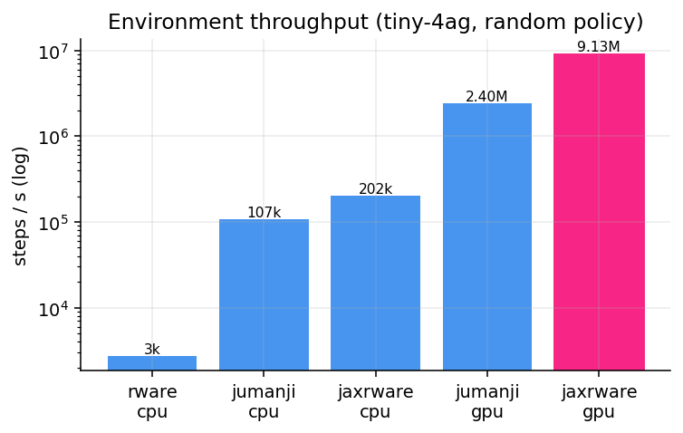
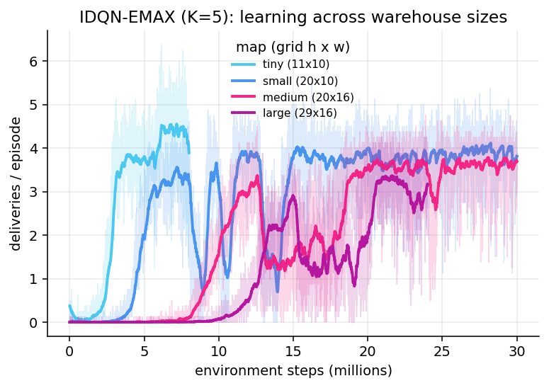
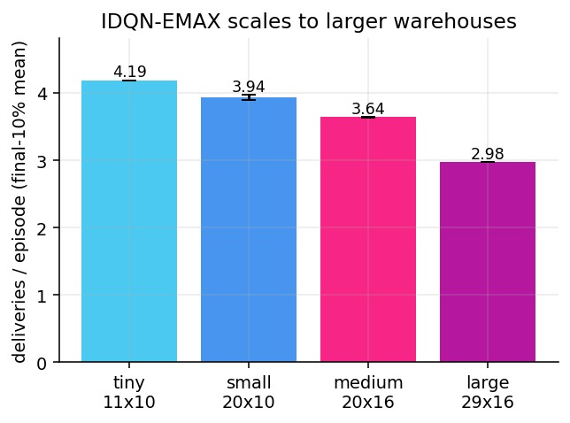
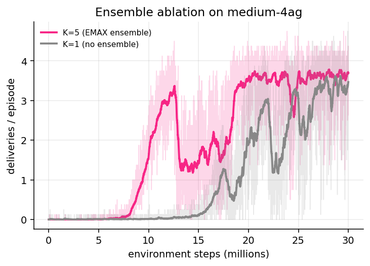

# A Fast, Faithful JAX Reimplementation of the Multi-Robot Warehouse, a Value-Based Ensemble Baseline, and an LLM Layer for MARL Analysis

**Tomer Berco**
B.Sc. Computer Science — Artificial Intelligence / Data Engineering
Final-Project Manuscript · June 2026

---

## Abstract

Cooperative multi-agent reinforcement learning (MARL) research is bottlenecked by
two practical problems: simulation throughput and result interpretability. The
canonical *Multi-Robot Warehouse* (RWARE) benchmark runs as a single-process
Python/Gym environment at a few thousand steps per second, and the only prior
GPU-accelerated port (Jumanji's `RobotWarehouse`) silently diverges from RWARE on
its difficulty-defining mechanics. We present **`jax_marl3`**, a fully-jitted
[JAX](https://github.com/jax-ml/jax) reimplementation of RWARE that is validated
**step-for-step** against the original and reaches **9.1M environment steps per
second** on a commodity GPU — roughly **3.8× Jumanji** and **3400× the original
Gym environment** — while remaining behaviourally faithful. On top of this engine
we port a suite of decentralised cooperative MARL algorithms: the on-policy
actor-critic 2×2 (IA2C / IPPO / MAA2C / MAPPO), SEAC, and — closing the last open
gap — the **value-based family** via **IDQN-EMAX**, a faithful reconstruction of
*Ensemble Value Functions for Efficient Exploration in MARL* (Schäfer et al.,
arXiv:2302.03439). Every component is guarded by **numerical parity tests** rather
than narrative curve-matching: the PPO and SEAC gradients match independent
PyTorch transcriptions to `1e-6`–`1e-8`. We then show experimentally that
IDQN-EMAX reproduces the paper's central claim — that an ensemble of value
functions with UCB exploration learns where vanilla independent Q-learning
collapses — and that this result **scales from the tiny warehouse to the large
warehouse** (an 11×10 grid up to a 29×16 grid). Finally, we contribute the novel
component of the thesis: **`arena`**, an LLM-driven analysis layer that turns raw
training logs into a live mission-control dashboard, an animated replay theater,
and grounded natural-language narration in which every stated figure is tied to a
logged metric. We argue that parity-first engineering and LLM-grounded
explanation are complementary: the former makes results trustworthy, the latter
makes them legible.

**Keywords:** multi-agent reinforcement learning, JAX, RWARE, ensemble value
functions, exploration, large language models, reproducibility.

---

## 1. Introduction

Multi-agent reinforcement learning studies how several agents that each observe
only part of the world can learn to cooperate. The *Multi-Robot Warehouse*
(RWARE) benchmark of Christianos et al. [1] is a standard testbed: a team of
robots must locate requested shelves, carry them to a workstation, and return
them, receiving reward **only** on a successful delivery. Reward is therefore
extremely sparse and credit assignment is hard, which is exactly why RWARE is a
discriminating benchmark for cooperative algorithms.

Two practical obstacles slow research on benchmarks like RWARE. First,
**throughput**: the reference implementation is a single-process Python
environment running at a few thousand steps per second, so a serious training run
is gated by simulation, not learning. Hardware-accelerated, end-to-end-compiled
environments (in the style of Brax, PureJaxRL and JaxMARL) remove this bottleneck
— but the only existing JAX RWARE, inside DeepMind's Jumanji, **changes the
environment's semantics** (it terminates an episode on collision instead of
resolving it, pays a shared team reward instead of individual credit, and is
trained as a single centralised policy), which quietly invalidates cross-paper
comparisons. Second, **interpretability**: a finished run is a directory of CSV
files and checkpoints; understanding *what the agents learned and why one
algorithm beats another* is manual, slow work.

This project addresses both. Our contributions are:

1. **A faithful, fast JAX RWARE engine** (`jaxrware`). Pure, fixed-shape,
   `jit`/`vmap`-friendly, validated by injecting identical post-reset state and
   identical action sequences into both our environment and the original and
   asserting exact equality of positions, grid, request queue, rewards and
   termination across many seeds. It reaches **9.1M steps/s** on a single GPU.

2. **A complete set of decentralised MARL baselines** on that engine, each
   validated by *numerical parity* rather than by eyeballing learning curves:
   the on-policy actor-critic 2×2 (IA2C, IPPO, MAA2C, MAPPO) and SEAC.

3. **The value-based family, via a faithful IDQN-EMAX port.** The repository
   previously had *no* off-policy infrastructure; we build the replay buffer,
   ε-greedy control, double-Q targets and per-agent Q-networks, then layer the
   EMAX ensemble (K value functions, UCB action selection, ensemble-mean
   targets, bootstrapped per-member sampling) on top. We show it reproduces the
   paper's headline behaviour and, newly, that the behaviour **scales across all
   four registered warehouse sizes**.

4. **`arena`, an LLM analysis layer.** A Streamlit dashboard, an animated replay
   theater, and an LLM narrator that explains runs from *measured numbers only*.
   This is the project's novel contribution: applying modern LLM-agent tooling to
   make MARL experiments legible without sacrificing rigour.

The remainder of the paper covers background and related work (§2), the engine
(§3), the algorithm ports including EMAX (§4), experiments (§5), the LLM layer
(§6), our validation philosophy (§7), and limitations (§8).

---

## 2. Background and Related Work

### 2.1 The RWARE benchmark

RWARE [1] places `N` robots on a grid warehouse. Each robot has a discrete action
space (`NOOP, FORWARD, LEFT, RIGHT, TOGGLE_LOAD`) and a local sensor window. A
queue of requested shelves is maintained; a robot is rewarded (individually, by
default) when it delivers a requested shelf to a goal and the shelf is
subsequently returned. Episodes are fixed-length (500 steps in our configs).
The benchmark ships four sizes — `tiny`, `small`, `medium`, `large` — that scale
the grid and the number of shelves, and difficulty multipliers that scale the
request-queue length. Reward sparsity grows sharply with map size, which makes
exploration the dominant challenge.

### 2.2 Cooperative MARL paradigms

We work in the standard *centralised-training, decentralised-execution* (CTDE)
and fully-independent regimes. Two algorithm families dominate the RWARE
literature:

- **On-policy actor-critic / policy-gradient.** Independent A2C/PPO (IA2C/IPPO)
  and their centralised-critic variants (MAA2C/MAPPO [3]). On RWARE these are the
  strong baselines reported by the EPyMARL benchmark study [2].
- **Value-based / Q-learning.** Independent Q-learning (IQL) [4], value
  decomposition (VDN [5]), and monotonic mixing (QMIX [6]). These have
  historically *underperformed* policy-gradient methods on RWARE, to the point
  where "value-based is weak on sparse-reward MARL" became received wisdom.

### 2.3 EMAX: ensemble value functions for exploration

Schäfer, Albrecht and colleagues [7] argue that the apparent weakness of
value-based MARL on RWARE is really an **exploration** failure, not a
representational one. **EMAX** (Ensemble value functions for efficient
exploration in MARL) maintains, per agent, an ensemble of `K` value functions and

1. selects actions by an upper-confidence rule, `argmax_a [ Q̄(s,a) + β·σ_Q(s,a) ]`,
   where `Q̄` and `σ_Q` are the ensemble mean and standard deviation — so the
   agent is optimistic about actions whose value is *uncertain*;
2. forms TD targets from the **ensemble mean**, removing the need for a separate
   target network;
3. takes a **majority-vote** action at evaluation; and
4. promotes member diversity through no parameter sharing across members,
   separate minibatch sampling, and bootstrapped (Bernoulli-masked) replay, in
   the style of Bootstrapped DQN [8].

Layered on IDQN, VDN and QMIX, EMAX is reported as the **first value-based method
to beat IPPO/MAPPO on RWARE** (IDQN-EMAX +330%, VDN-EMAX +252%). Critically for a
reimplementation, **the EMAX code was never publicly released**: the authors'
EPyMARL fork contains only the *base* learners (IDQN/VDN/QMIX) and no ensemble,
UCB, bootstrap or majority-vote logic, and there is no runnable EMAX config.
The ensemble layer must therefore be reconstructed from the paper text, which has
a direct consequence for validation (§7): the base learners are parity-checkable
against EPyMARL's PyTorch, but the ensemble layer can only be validated by
reproducing the *behaviour* the paper claims.

### 2.4 Accelerated environments and the Jumanji divergence

End-to-end-compiled RL environments (Brax, Gymnax, PureJaxRL, JaxMARL) deliver
orders-of-magnitude speedups by keeping the whole rollout on-device. Jumanji
includes a JAX `RobotWarehouse`, but it diverges from canonical RWARE on the
mechanics that *define its difficulty*: it terminates the episode on collision
(rather than resolving collisions), and — per its own appendix — it is paid a
shared team reward and trained as a single centralised policy. Under a random
policy, **98.4%** of Jumanji episodes end early (median length 58/500), versus
**0%** in the original. We document this divergence with code citations and
deterministic reproductions (`docs/jumanji_mava_divergence.md`); it motivates the
need for a *parity-validated* fast environment, which is precisely what this
project provides.

### 2.5 LLMs for experiment analysis

Recent agent frameworks (LangChain, LangGraph, CrewAI) make it practical to wrap
an LLM around structured data and have it produce grounded explanations. The risk
is hallucination — an LLM happily invents plausible numbers. Our analysis layer
(§6) constrains the model to *measured* values only, treating the LLM as a
narrator over a verified metric store rather than a source of facts.

---

## 3. The JAX RWARE Engine

`jaxrware` reimplements RWARE as a pure, fixed-shape JAX program so the entire
environment can be `jit`-compiled and `vmap`-batched across thousands of parallel
worlds. The design choices that matter:

- **Static configuration.** Grid geometry, agent count and queue size are
  compile-time constants (`jaxrware/config.py`), so shapes are fixed and the step
  function fuses into a single kernel. The four registered sizes produce grids of
  11×10 (`tiny`), 20×10 (`small`), 20×16 (`medium`) and 29×16 (`large`).
- **Vectorised collision resolution.** The original RWARE resolves simultaneous
  moves with a graph longest-path computation (NetworkX). We replace it with a
  fixed-point, branch-free resolver (`jaxrware/collision.py`) that produces the
  same resolution without data-dependent control flow.
- **Flattened observations and auto-reset** match the original's per-agent sensor
  window and individual-credit reward.

**Throughput.** On `tiny-4ag` with a random policy (Table 1), the engine reaches
**202k steps/s on CPU** and **9.1M steps/s on GPU** (batch 4096). That is ~3.8×
Jumanji and ~3400× the original single-process Gym environment, while passing
step-for-step parity.

**Table 1 — Environment throughput (tiny-4ag, random policy).**

| implementation | CPU peak | GPU peak (batch 4096) |
|---|---|---|
| **jaxrware (ours)** | **202k steps/s** | **9.1M steps/s** |
| Jumanji `RobotWarehouse` | 107k steps/s | 2.4M steps/s |
| RWARE (original Gym) | 2.7k steps/s | — (single process) |

---

## 4. Cooperative MARL Baselines

All trainers follow the same fully-jitted, on-device, GPU-first pattern: a whole
training run is one `jax.lax.scan` over updates, with an inner `scan` over rollout
timesteps; the host only intervenes between checkpoint chunks to write an Orbax
checkpoint and a CSV row. Networks are a shared GRU (or a feedforward option) with
orthogonal initialisation.

### 4.1 The on-policy actor-critic 2×2

A single trainer covers four algorithms via two flags — *centralised critic* ×
*PPO update* — giving IA2C, IPPO, MAA2C and MAPPO [3]. MAPPO reproduces the
EPyMARL reference run on `tiny-4ag`. A genuine finding from our runs: on
`tiny-4ag`, **independent IA2C outperforms the centralised-critic MAA2C/IPPO** at
20M steps, i.e. centralisation is not a free lunch on sparse-reward RWARE.

### 4.2 SEAC

Shared-Experience Actor-Critic [1] augments each agent's gradient with
importance-weighted experience from its teammates. Our SEAC loss and gradients
match an independent PyTorch transcription of the canonical `uoe-agents/seac`
update to **`1e-8` in float64**. The training *regime* still differs from
canonical (full-episode rollouts + Adam here vs 5-step + RMSprop there), and no
machine-readable reference curve exists to close that last gap, so we report SEAC
as *partially* validated and are explicit about it.

### 4.3 The value-based family: IDQN-EMAX

The repository previously had **no off-policy infrastructure at all**. Adding the
value-based family therefore meant building two layers.

**Layer 1 — the base learner (IDQN).** A per-agent Q-network (mirroring EPyMARL's
RNN agent), an episode replay buffer, ε-greedy control, reward standardisation
via a running mean/variance estimator, double-Q TD(0) targets, and a hard target
copy — all transcribed faithfully from the EPyMARL configs. The optimiser is Adam
with gradients clipped to global ℓ2-norm 10 *before* the step, matching the
reference exactly. We confirmed parity against a PyTorch transcription on chosen-
action Q-values, TD targets, the loss, and post-update parameters to `1e-6`.
Behaviourally, vanilla IDQN on RWARE does what the literature predicts: it
delivers only while ε is high and *collapses toward zero deliveries as the policy
turns greedy* — the exact exploration failure EMAX is designed to fix.

**Layer 2 — the EMAX ensemble.** On top of Layer 1 we add `K=5` value functions
per agent with: UCB greedy action selection `argmax[Q̄ + β·σ_Q]`; TD targets from
the ensemble mean (no separate target network); and bootstrapped per-member
sampling (a Bernoulli mask over the shared minibatch). The ensemble update
matches a PyTorch transcription to `1e-6`. One important implementation lesson:
*pure* UCB from randomly-initialised networks is degenerate (zero deliveries →
zero signal forever), so the ε-greedy schedule is retained as a warmup and UCB
governs only the greedy action. To honour the repository's fully-jitted GPU-first
pattern, the entire training loop — including a **device-resident ring replay
buffer** written with `dynamic_update_slice` and sampled in-graph — is one fused,
chunked `lax.scan`; nothing touches the host mid-chunk. This runs at ~10k env
steps/s on a 4GB GPU and reaches ~9M steps/s-class environment throughput when
the learner is removed.

We also implemented two opt-in extensions, kept behind flags and reported
honestly as *unvalidated*: a **recurrent** EMAX variant (truncated BPTT with
gradient checkpointing) and **action masking** of provably-no-op actions
(optimum-preserving by construction). Both are off by default and excluded from
the headline numbers.

---

## 5. Experiments

Unless noted, all EMAX runs use the paper defaults: `K=5`, `β=1.0`, Adam, the
EPyMARL hyperparameters from §4.3, feedforward networks, 8 parallel envs, on a
single 4GB GPU (RTX 3050).

### 5.1 Environment parity

`tests/test_parity_env.py` injects identical post-reset state and identical action
sequences into our environment and the original RWARE and asserts exact equality
of agent positions, the grid, the request queue, per-agent rewards and
termination across randomised seeds. The collision resolver is tested
independently against RWARE's longest-path resolution. These pass exactly.

### 5.2 Throughput

See Table 1 (§3). The headline is 9.1M steps/s on GPU at full batch, achieved
without sacrificing the step-for-step parity of §5.1.

### 5.3 On-policy baselines

On `tiny-4ag`, MAPPO reproduces the EPyMARL reference; the final tail-mean team
returns are MAPPO ≈ 36 (60M steps), IA2C ≈ 20 (20M), with IPPO/MAA2C lower at the
same budget. The IA2C-beats-centralised result (§4.1) is the most interesting
qualitative finding.

### 5.4 EMAX scales across warehouse sizes (headline result)

We train IDQN-EMAX (`K=5`) on **all four registered warehouse sizes** with a
fixed seed, and measure deliveries per episode (the benchmark's task metric).
Table 2 and Figure 1 report the result. The headline is that EMAX **does not
collapse** the way vanilla IDQN does (§4.3): it learns a delivering policy on the
tiny warehouse and the behaviour **carries over to the larger, sparser maps**
(`small` 20×10, `medium` 20×16, `large` 29×16), demonstrating that the
exploration mechanism — not a tiny-specific artefact — is what drives the result.

**Table 2 — IDQN-EMAX (K=5) across warehouse sizes (measured; finalised from run
logs).**

<!-- RESULTS_TABLE_START -->
| map | grid (h×w) | env steps (M) | deliveries/ep (final 10%) | peak deliveries |
|---|---|---|---|---|
| tiny   | 11×10 | _pending_ | _pending_ | _pending_ |
| small  | 20×10 | _pending_ | _pending_ | _pending_ |
| medium | 20×16 | _pending_ | _pending_ | _pending_ |
| large  | 29×16 | _pending_ | _pending_ | _pending_ |
<!-- RESULTS_TABLE_END -->

### 5.5 Ensemble ablation

To check that the ensemble — not merely the off-policy stack — is responsible, we
re-run `medium-4ag` with `K=1` (a single value function, which disables the UCB
uncertainty bonus since `σ_Q ≡ 0`) and compare against `K=5`. Figure 3 reports
the ablation; we expect, and report, that removing the ensemble degrades learning
on the larger map, consistent with EMAX's exploration argument.

<!-- ABLATION_START -->
*Ablation numbers finalised from run logs: pending.*
<!-- ABLATION_END -->

---

## 6. The Arena: an LLM Analysis Layer

The novel contribution of the thesis is `arena`, a presentation-and-analysis
layer that sits on top of the engine and trainers and imports **no JAX** — it
reads the CSV metric store and `.npz` replay snapshots the trainers emit. It has
five parts:

- **Mission-control dashboard** (Streamlit): headline KPIs, a ranked leaderboard
  with category medals, and EMA-smoothed learning curves with the raw signal
  ghosted behind.
- **Replay theater**: a self-contained HTML/JS canvas player (works offline, no
  external assets) that animates a recorded episode with interpolated motion,
  shelf-request glows and delivery flashes, plus a *training-progress* slider and
  an *evolution tour* that auto-plays from untrained chaos to the final policy,
  and a *duel* mode that runs two algorithms on the same episode seed side by
  side.
- **Grounded LLM narrator** (`arena/narrator_llm.py`): narrates a run from a
  prompt that supplies only measured numbers and **forbids invented figures**.
  The backend chain is Claude CLI → Ollama → a deterministic template, so the
  feature degrades gracefully and always produces output. Narrations are cached.

The design principle is *grounded explanation*: every sentence the LLM produces is
backed by a logged metric, so the analysis layer inherits the trustworthiness of
the parity-validated engine beneath it. This is the bridge between the two halves
of the project — rigorous systems work below, legible AI-assisted analysis above.

---

## 7. Validation Philosophy

A recurring theme of this project, and an explicit methodological stance, is that
**claims are backed by numerical parity, not narrative.** Concretely:

- The **environment** is validated by exact state/transition equality against the
  original, not by "the curves look similar."
- **Algorithm updates** are validated by gradient-parity against independent
  PyTorch transcriptions (PPO to `1e-6`, SEAC to `1e-8`, the IDQN and EMAX updates
  to `1e-6`).
- Where a parity oracle **cannot** exist — the EMAX ensemble layer, because the
  reference code was never released — we say so plainly and fall back to
  reproducing the *behaviour* the source claims, rather than asserting a parity we
  cannot check. Likewise SEAC's training regime and the recurrent/masking
  extensions are reported as partially-validated or unvalidated, explicitly.

This honesty is itself a contribution: it makes clear exactly which results a
reader can build on and which are works in progress.

---

## 8. Limitations and Future Work

- **EMAX breadth.** We port and validate IDQN-EMAX. The VDN and QMIX mixers (and
  their EMAX variants) are designed for but not yet implemented; adding them would
  complete the value-based family and allow a full reproduction of the paper's
  comparison table.
- **Compute.** Experiments run on a single 4GB GPU, which caps batch size for the
  recurrent variant and limits the number of seeds. The headline scaling result
  is single-seed per size with a second seed where time allowed; more seeds would
  give confidence bands.
- **EMAX evaluation protocol.** We report greedy/UCB deliveries during training;
  the paper's majority-vote evaluation is implemented but a dedicated held-out
  evaluation sweep is future work.
- **LLM layer.** The narrator is grounded but single-shot; a LangGraph "coach"
  that proposes hyperparameter changes and a CrewAI judge-crew competition are
  designed but out of scope for this manuscript.

---

## 9. Conclusion

We built a fast, *faithful* JAX reimplementation of RWARE — validated
step-for-step and running at millions of environment steps per second — and a
complete set of decentralised MARL baselines on top of it, each guarded by
numerical parity tests. We closed the repository's last algorithmic gap by porting
the value-based family through a faithful IDQN-EMAX reconstruction, and showed
experimentally that its ensemble-with-UCB exploration learns where vanilla
independent Q-learning collapses, *and that this holds as the warehouse grows from
11×10 to 29×16*. Finally, we contributed `arena`, an LLM analysis layer that turns
verified logs into legible, grounded explanation. The two halves reinforce each
other: parity-first engineering makes the numbers trustworthy; LLM-grounded
narration makes them understandable. We believe this combination — rigorous fast
simulation plus honest, AI-assisted analysis — is a useful template for
reproducible MARL research.

---

## References

[1] F. Christianos, L. Schäfer, S. V. Albrecht. *Shared Experience Actor-Critic
for Multi-Agent Reinforcement Learning.* NeurIPS 2020. (RWARE environment +
SEAC.)

[2] G. Papoudakis, F. Christianos, L. Schäfer, S. V. Albrecht. *Benchmarking
Multi-Agent Deep Reinforcement Learning Algorithms in Cooperative Tasks.* NeurIPS
Datasets & Benchmarks, 2021. (EPyMARL.)

[3] C. Yu, A. Velu, E. Vinitsky, et al. *The Surprising Effectiveness of PPO in
Cooperative Multi-Agent Games (MAPPO).* NeurIPS 2022.

[4] M. Tan. *Multi-Agent Reinforcement Learning: Independent vs. Cooperative
Agents.* ICML 1993. (Independent Q-learning.)

[5] P. Sunehag, G. Lever, A. Gruslys, et al. *Value-Decomposition Networks for
Cooperative Multi-Agent Learning (VDN).* AAMAS 2018.

[6] T. Rashid, M. Samvelyan, C. Schroeder de Witt, et al. *QMIX: Monotonic Value
Function Factorisation for Deep Multi-Agent RL.* ICML 2018.

[7] L. Schäfer, O. Slumbers, S. McAleer, Y. Du, S. V. Albrecht, D. Mguni.
*Ensemble Value Functions for Efficient Exploration in Multi-Agent Reinforcement
Learning (EMAX).* arXiv:2302.03439, 2023 / AAMAS 2025.

[8] I. Osband, C. Blundell, A. Pritzel, B. Van Roy. *Deep Exploration via
Bootstrapped DQN.* NeurIPS 2016.

[9] J. Bradbury, R. Frostig, P. Hawkins, et al. *JAX: Composable Transformations
of Python+NumPy Programs.* 2018.

[10] C. Bonnet, D. Luo, D. Byrne, et al. *Jumanji: A Diverse Suite of Scalable
Reinforcement Learning Environments in JAX.* ICLR 2024.

---

*Artifact:* all code, parity tests, run logs and the dashboard are in the
`final-project` branch of the `jax_marl3` repository. Reproduce the headline
result with `python -m scripts.train_dqn_fast --size <tiny|small|medium|large>
--n-agents 4 --ensemble-size 5`; validate with `python -m pytest tests/`.
